# SwarmUI LLM Assistant

A full LLM workspace inside [SwarmUI](https://github.com/mcmonkeyprojects/SwarmUI) — persistent chats, custom assistants, agentic tool calling, vision, side-by-side model comparison, a floating in-page companion, and deep Generate-tab prompt integration.

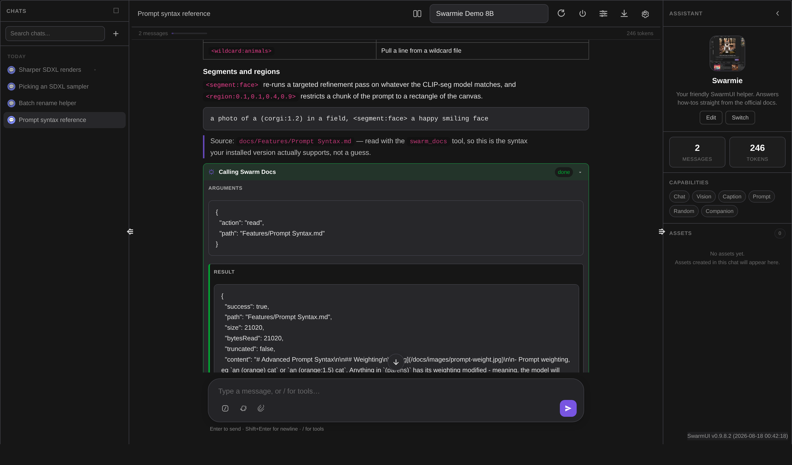

It ships its own LLM runtimes, so there is nothing else to install: a **pure-C# local GGUF engine**, **Anthropic Claude**, and **any OpenAI-compatible endpoint** (OpenAI, Ollama, LM Studio, vLLM, OpenRouter, …). Pick one under `Server > Backends` and the tab lights up.

| | |
|---|---|
| **Version** | `2.0.0-alpha.2` |
| **Requires** | SwarmUI (tested against `0.9.8.2`) |
| **Local engine** | [`HartsyInference`](https://www.nuget.org/packages/HartsyInference) `2.0.0-alpha.23` (NuGet, pulled automatically) |
| **License** | MIT |

---

## Contents

- [Highlights](#highlights)
- [Requirements](#requirements)
- [Installation](#installation)
- [Adding an LLM backend](#adding-an-llm-backend)
- [Quick start](#quick-start)
- [The interface](#the-interface)
- [Assistants](#assistants)
- [Tool calling](#tool-calling)
- [Built-in tools](#built-in-tools)
- [Vision](#vision)
- [Assets](#assets)
- [Companion overlay](#companion-overlay)
- [Per-user memory](#per-user-memory)
- [Generate-tab integration](#generate-tab-integration)
- [Settings reference](#settings-reference)
- [Permissions](#permissions)
- [Multi-user model](#multi-user-model)
- [API reference](#api-reference)
- [Architecture](#architecture)
- [Troubleshooting](#troubleshooting)
- [Known limitations](#known-limitations)
- [License & credits](#license--credits)

---

## Highlights

- **Real chats, stored on the server.** Threads are grouped by date, searchable, renameable, exportable (JSON / Markdown / plain text), and auto-titled from the first exchange. Your message is saved *before* the model is called, so a disconnect never loses it.
- **Message branching.** Edit a message or regenerate a reply and the old version survives as a switchable sibling branch — no destructive edits.
- **Side-by-side comparison.** Run the same prompt through two models at once, in parallel, then keep the winner.
- **Agentic tool calling.** 13 built-in tools, up to 8 tool rounds per turn, with per-tool permissions, sandboxing, SSRF protection, rate limits, and an optional audit log. Providers with a native tool API (Anthropic, OpenAI) use it; everything else uses a text tag convention that works on any model that can stream text.
- **Custom assistants.** Per-mode system prompts, inheritance, per-model prompt variants, parameter overrides, avatars, and a per-assistant tool allowlist.
- **Rich rendering.** GitHub-flavored Markdown, syntax highlighting, tables, KaTeX math, and Mermaid diagrams — all sanitized through DOMPurify, all served locally. **No CDN, no outbound requests.**
- **Floating companion.** An opt-in in-page helper that can critique your last render, suggest a preset, or explain a SwarmUI feature from the bundled docs.
- **Prompt integration.** `<llmprompt:…>` tags in the Generate tab are expanded by the LLM at generation time.

---

## Requirements

- A working SwarmUI install.
- At least one LLM backend added under `Server > Backends` (see below).
- For the local engine: `.gguf` weights in `Models/llm/` and, ideally, an NVIDIA GPU (CPU works, slowly).
- For Anthropic / OpenAI: each user sets their **own** API key in the `User` tab. No key is stored server-wide.

---

## Installation

1. Clone into SwarmUI's extension folder:

   ```bash
   cd /path/to/SwarmUI/src/Extensions/
   git clone https://github.com/HartsyAI/SwarmUI-LLMAssistant.git
   ```

2. Rebuild SwarmUI — run `update-windows.bat` or `update-linuxmac.sh` from the SwarmUI root. This restores the `HartsyInference` NuGet package the local engine needs.

3. Restart SwarmUI. An **LLM Assistant** tab appears in the main tab strip.

4. (Local engine only) Drop GGUF weights into `Models/llm/`. They show up in SwarmUI's model browser too — the extension registers `LLM` as a first-class model type.

---

## Adding an LLM backend

Go to `Server > Backends` — the three LLM backend types appear directly in the "Add new backend" row.

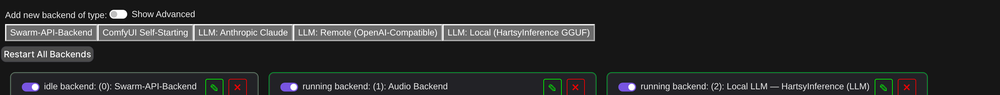

| Backend type | What it is |
|---|---|
| **LLM: Local (HartsyInference GGUF)** | Pure-C# GGUF inference. No llama.cpp, no Python, no external process. Reads from `Models/llm/`. |
| **LLM: Anthropic Claude** | Anthropic's Messages API, using each user's own `anthropic_api` key. Native `tools` / `tool_choice` support. |
| **LLM: Remote (OpenAI-Compatible)** | Any OpenAI-compatible HTTP endpoint. Each user's own `openai_api` key overrides the configured `Authorization` header. |

### Local engine settings

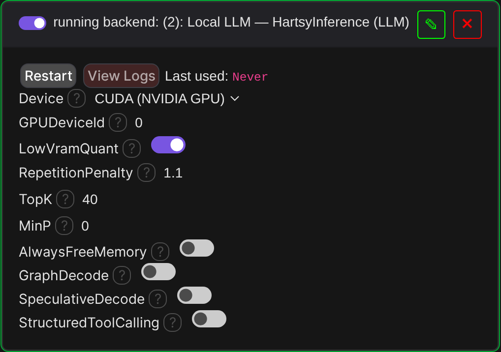

| Setting | Default | Notes |
|---|---|---|
| `Device` | `cuda` | `cuda` (NVIDIA GPU) or `cpu`. |
| `GPUDeviceId` | `0` | CUDA ordinal. One backend instance per GPU for multi-GPU. |
| `LowVramQuant` | `false` | Keep quantized weights compressed on-device — lower VRAM, slower decode. |
| `RepetitionPenalty` | `1.1` | Small models loop without this. Ignored at temperature 0. |
| `TopK` | `40` | `0` disables. |
| `MinP` | `0.0` | `0` disables. |
| `AlwaysFreeMemory` | `false` | Unload the model after every generation instead of keeping it resident. |
| `GraphDecode` | `false` | CUDA-graph decode for plain dense Llama/Qwen/Mistral shapes. Requires the request to end up greedy (temperature 0). |
| `SpeculativeDecode` | `false` | Prompt-lookup speculative decoding, no draft model. Same greedy-only eligibility; biggest win on repetitive output. |
| `StructuredToolCalling` | `false` | Grammar-mask *only* the JSON between `<tool_call>` and `</tool_call>` so a tool call is always valid JSON. Plain chat text stays unconstrained. |

### Remote (OpenAI-compatible) settings

| Setting | Default | Notes |
|---|---|---|
| `Address` | *(empty)* | e.g. `http://localhost:11434` (Ollama) or `https://api.openai.com`. |
| `AllowIdle` | `false` | Let the backend sit idle instead of erroring when the endpoint is unreachable. |
| `AuthorizationHeader` | *(empty)* | Overridden per-request by the calling user's `openai_api` key when they have one set. |
| `OtherHeaders` | *(empty)* | Newline-separated `Header: value` pairs. |
| `DefaultModel` | *(empty)* | Used when a request doesn't name a model. |
| `TokenLimitParameter` | `auto` | `auto` picks `max_completion_tokens` for `api.openai.com` and `max_tokens` everywhere else. |
| `ConnectionAttemptTimeoutSeconds` | `30` | Lower this (e.g. `5`) for LAN endpoints. |
| `NativeToolCalling` | `auto` | `auto` enables native `tools`/`tool_calls` only for `api.openai.com`. Self-hosted servers vary in quality here, so they stay on the tag convention unless you set `on`. |

### Anthropic settings

| Setting | Default |
|---|---|
| `DefaultModel` | `claude-opus-4-8` |
| `TimeoutSeconds` | `120` |
| `BaseUrl` | `https://api.anthropic.com` |

Anthropic's tool API is always on — there's no toggle, because it's one stable contract. Set your key in the `User` tab.

---

## Quick start

1. Open the **LLM Assistant** tab. If you have more than one assistant, you get the gallery; otherwise you drop straight into a chat.

   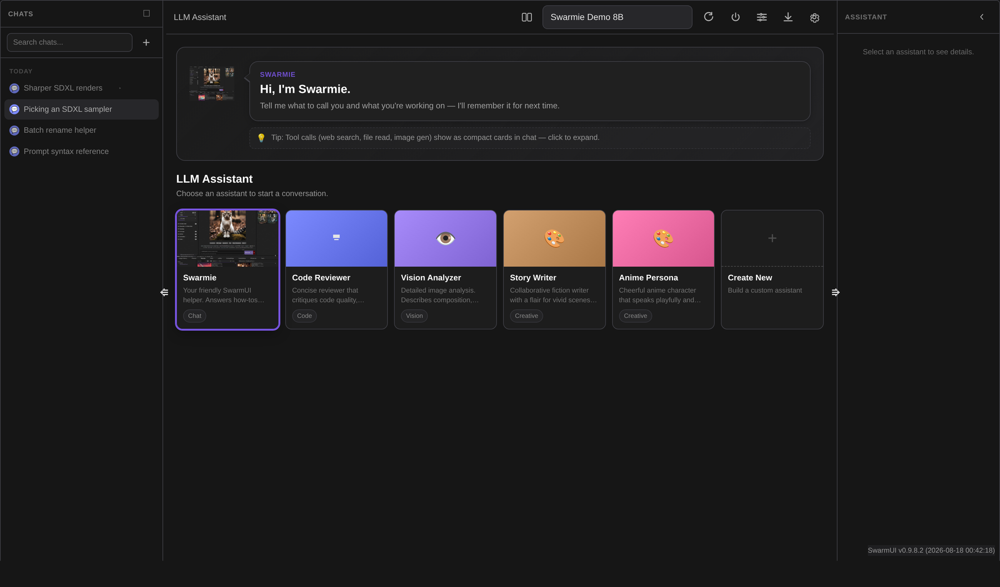

2. Pick a model from the dropdown in the top bar.
3. Type. `Enter` sends, `Shift+Enter` makes a newline, `/` opens the tool picker, and the paperclip (or a drag-and-drop) attaches an image.
4. Everything else — parameters, export, settings, the assistant panel — hangs off the top bar and the right-hand panel.

---

## The interface

**Left sidebar** — chats grouped by date, with search, multi-select delete, and `F2` to rename inline.

**Top bar** — thread title, model picker, compare toggle, model refresh, unload-model (frees VRAM), per-thread parameter overrides, export, and settings.

**Right panel** — the active assistant (with capability badges), live message/token counters, and the thread's Assets index.

Both split bars are draggable and remember their width; double-click resets them.

### Keyboard shortcuts

| Shortcut | Action |
|---|---|
| `Ctrl/Cmd + K` | Focus chat search |
| `Ctrl/Cmd + N` | New chat with the active assistant |
| `Ctrl/Cmd + Shift + F` | Find in the current chat |
| `F2` | Rename the focused chat |
| `↑` / `↓` | Move through the chat list (when a chat row has focus) |
| `Esc` | Close popovers, the asset viewer, or settings |
| `/` | Tool picker (in the composer) |
| `Enter` / `Shift+Enter` | Send / newline (swap with the **Enter to Send** setting) |
| `Ctrl/Cmd + Enter` | Send, regardless of the **Enter to Send** setting |

### Compare two models

Click the compare icon next to the model picker, choose a second model, and send once. Both lanes stream in parallel over one socket; each reply is persisted as a sibling of your message, tagged with the device it ran on. **Keep this one** promotes a lane to the thread's main path.

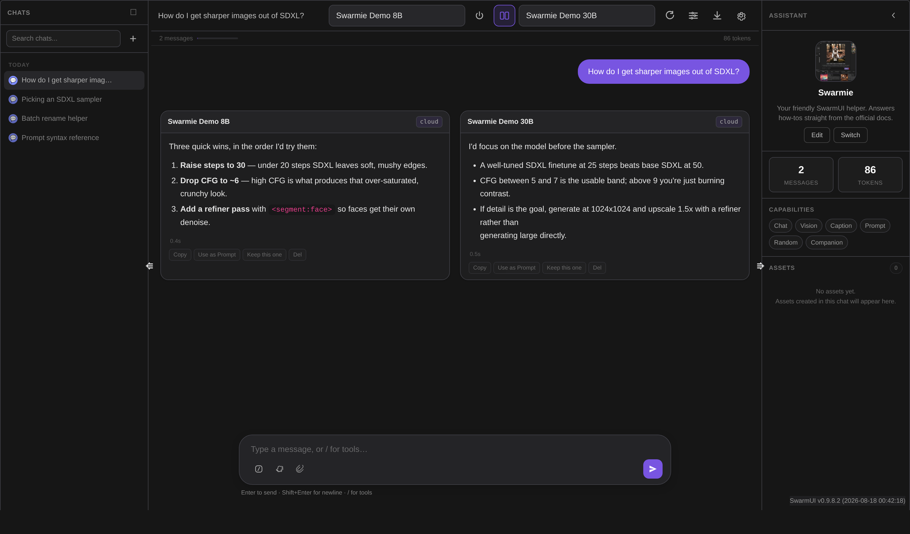

### Branching

Editing one of your messages, or regenerating a reply, creates a **new branch** rather than overwriting. The old version stays reachable through the pager on the message. Under the hood the thread is a tree with an `activeLeafId`; the conversation you see is the root→leaf path.

---

## Assistants

An assistant bundles a persona, its system prompts, its parameters, and the tools it's allowed to use.

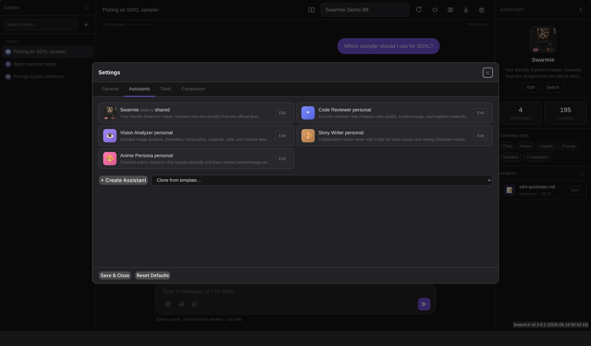

Open `Settings > Assistants` to create one from scratch, or clone one of the bundled starter templates (Anime Persona, Code Reviewer, Concise Translator, Story Writer, Vision Analyzer).

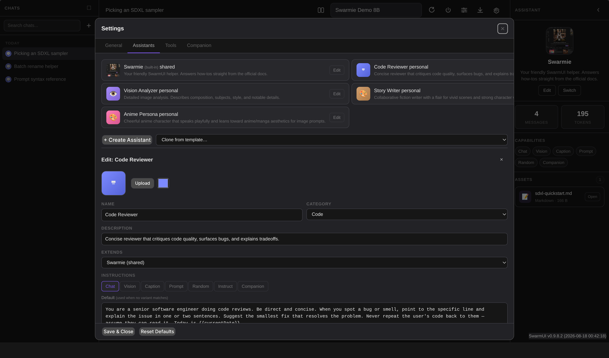

Each assistant has:

- **Identity** — name, category, description, color, and an uploaded avatar.
- **Seven instruction modes** — `chat`, `vision`, `caption`, `prompt`, `randomprompt`, `instructiongen`, `companion`. Each mode is its own system prompt.
- **Per-model variants** — any instruction can carry alternates keyed on the model's `Exact` id, `Family`, `Provider`, `Tag`, or a `Glob` pattern. Specificity order: `Exact > Family > Provider > Tag > Glob`.
- **Inheritance (`extends`)** — inherit instructions, parameters, and enabled tools from another assistant, then override selectively. Cycle-safe.
- **Parameter overrides** — temperature / max tokens / top-p, blank to fall back to your global defaults.
- **Tool allowlist** — a master on/off plus a per-tool checklist, and per-assistant tool config that overrides your account defaults.
- **A test runner** — run a sample message against the unsaved instruction text before you commit it.

Prompt variables are substituted at request time: `{{assistantName}}`, `{{userName}}`, `{{userProfile}}`, `{{currentDate}}`.

The built-in **Swarmie** assistant is a SwarmUI-savvy helper that answers how-to questions by actually reading the bundled docs with the `swarm_docs` tool and citing them.

---

## Tool calling

The model can call tools, get real results back, and keep going — up to **8 rounds** per user turn before the loop is cut off with `truncated: true`.

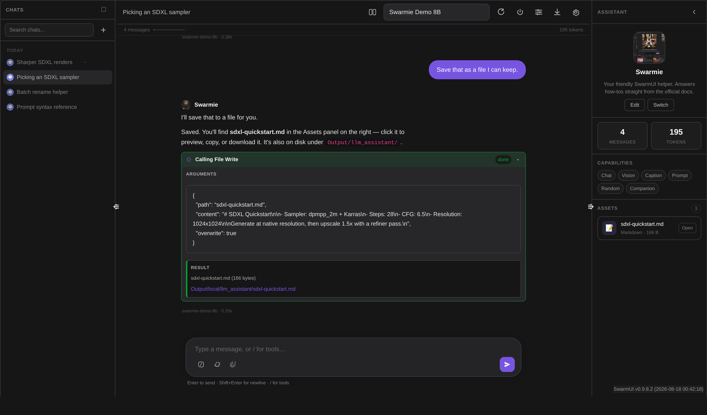

How the call is made depends on the provider:

| Provider | Mechanism |
|---|---|
| **Anthropic** | Native `tools` + `tool_choice`, parsed from the real `tool_use` / `input_json_delta` SSE events. A forced tool becomes a genuine `tool_choice` constraint. |
| **OpenAI-compatible** | Native `tools` + incremental `delta.tool_calls[]`, resolved at `finish_reason == "tool_calls"`. Enabled by the `NativeToolCalling` setting (`auto` = `api.openai.com` only). |
| **Everything else** | A text convention: the model emits `<tool_call>{"name":"…","arguments":{…}}</tool_call>`, which the streaming layer detects with a cheap tail-window scan and executes. |

All three normalize to the same `tool_call` / `tool_result` events, so nothing downstream cares which path was used. Malformed JSON isn't swallowed — the model gets an error result back and can retry, and near-valid JSON is run through a repair pass first (fence unwrapping, trailing commas, unbalanced brackets from truncation), with the repair verified by actually re-parsing.

### Running a tool yourself

Type `/` in the composer to get a searchable picker of every tool enabled for the current assistant. Pick one, fill in the form, and it runs directly — no model in the loop. The call is persisted into the thread exactly like a model-driven one.

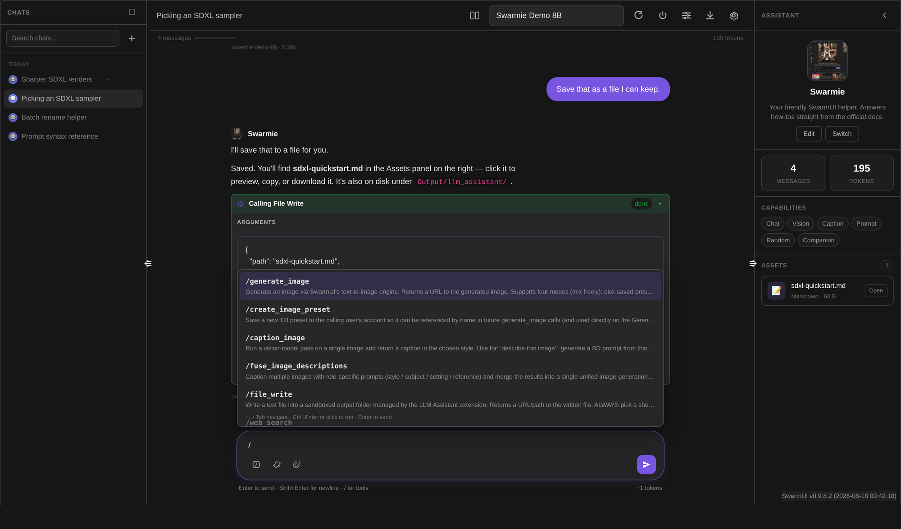

### Per-conversation toggle

The wrench button in the composer turns tool calling on or off for *this chat*, overriding the assistant's default. With tools off, no tool descriptions are injected into the system prompt at all — small local models get reliably confused by them.

---

## Built-in tools

Thirteen tools ship with the extension. Every one is gated by a permission (see [Permissions](#permissions)) and, where relevant, sandboxed and rate-limited.

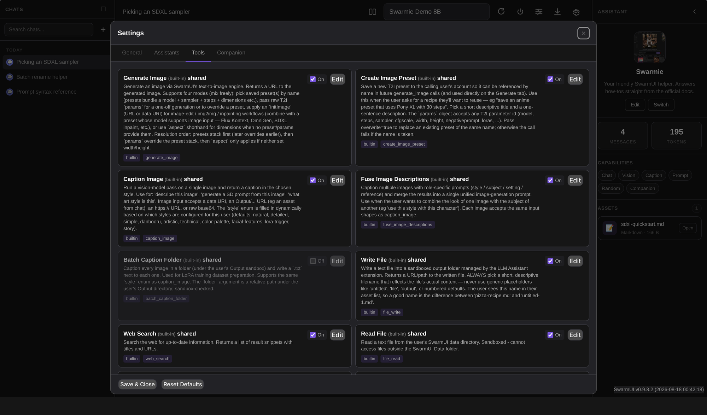

| Tool | What it does | Enabled by default | Permission |
|---|---|:---:|---|
| `generate_image` | Runs SwarmUI's T2I engine. Supports saved presets, raw T2I params, `initImage` for img2img/inpaint, and aspect shorthand. Returns an image URL. | ✅ | `llm_tool_generate_image` |
| `create_image_preset` | Saves a T2I preset to the calling user's account. Also needs SwarmUI's core `Manage Presets` permission. | ✅ | `llm_tool_create_image_preset` |
| `caption_image` | Vision pass over one image in a chosen caption style. | ✅ | `llm_tool_vision` |
| `fuse_image_descriptions` | Captions several images with role-specific prompts (style / subject / setting / reference) and merges them into one prompt. | ✅ | `llm_tool_vision` |
| `batch_caption_folder` | Captions every image in a folder and writes `.txt` sidecars, for LoRA dataset prep. Sandboxed to your Output dir. | ❌ | `llm_tool_vision` |
| `web_search` | DuckDuckGo HTML scrape. Returns `{title, url, snippet}`. | ✅ | `llm_tool_web_search` |
| `file_read` | Reads a text file inside SwarmUI's `Data` directory. 64 KB default cap. | ✅ | `llm_tool_file_read` |
| `file_write` | Writes a text file into `Output/…/llm_assistant/`. Extension allowlist (`md, json, txt, yaml, yml, csv, log` plus your own additions). | ✅ | `llm_tool_file_write` |
| `http_request` | GET/POST/PUT/DELETE/HEAD/PATCH. Blocks loopback, RFC1918, link-local, and cloud metadata addresses. 256 KB default response cap. | ✅ | `llm_tool_http_request` |
| `shell_exec` | Runs a shell command on the host. Sandboxed working dir, 30 s default timeout, 64 KB output cap. | ❌ | `llm_tool_shell_exec` |
| `memory_write` | Saves a fact to the calling user's private memory profile. | ✅ | `llm_tool_memory` |
| `memory_read` | Reads the calling user's memory profile. | ✅ | `llm_tool_memory` |
| `swarm_docs` | Lists and reads SwarmUI's bundled docs. Sandboxed strictly to `docs/`. | ✅ | `llm_tool_swarm_docs` |

> **`shell_exec` is off by default and its permission defaults to `NOBODY`.** Granting it is equivalent to giving anyone who can chat with the model a shell on your server. Only do it for admins you trust, on models you trust.

### Guardrails

- **Permissions are keyed on the *handler*, not the tool id** — so defining a custom tool `{ id: "harmless", handlerId: "shell_exec" }` can't bypass the `shell_exec` gate.
- **60-second execution timeout** per tool call, plus each tool's own limits.
- **Rate limits** — a per-user, per-tool sliding hour window. Defaults: `http_request` 60/h, `web_search` 30/h, `shell_exec` 20/h, `generate_image` 100/h, `batch_caption_folder` 5/h. Override per tool in its editor; `0` means unlimited.
- **Audit log** — an opt-in append-only JSONL trail of `shell_exec`, `file_write`, and `http_request` calls plus every shared-layer write, at `Data/LLMAssistant/audit.log`. Size-rotated at 10 MB × 5 generations. Toggle it with `LLMAssistantSetAuditLogEnabled` (admin only).

### Custom tools

`Settings > Tools > + Create Tool` registers a new tool: id, name, description (this is what the model sees), a JSON Schema for the parameters, and a handler id that maps to a registered `ToolHandler`. There's a **Run Test** panel for development. Handler types today: `builtin`; `mcp_stdio` and `mcp_http` are reserved for planned MCP support.

---

## Vision

Assistants with a `vision` instruction accept image attachments. Attach with the paperclip or drag-and-drop; the image is uploaded once, downscaled to the configured long-edge cap, and stored as a URL on the message — the thread blob never carries base64.

The same vision path backs the `caption_image` tool, `fuse_image_descriptions`, `batch_caption_folder`, the companion's "Critique my last image", and the Generate tab's magic-vision action.

The **Vision Image Max Size** setting (256–2048 px, default 1536) controls the downscale. Lower it to cut vision-token cost on paid APIs.

---

## Assets

Anything worth keeping is promoted to the thread's **Assets** index in the right panel: fenced code blocks (8+ lines or 400+ bytes — smaller ones stay inline), HTML/SVG snippets, and results from `generate_image`, `file_read`, and `file_write`.

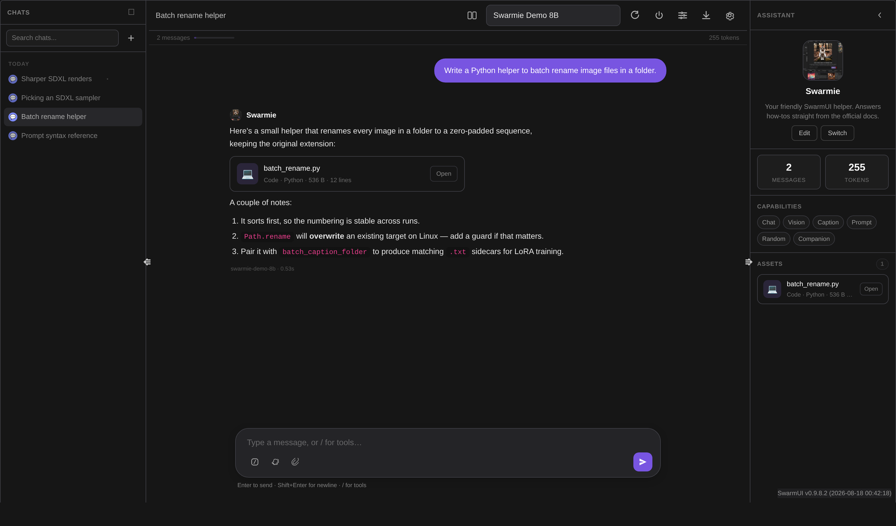

Click one to open the viewer:

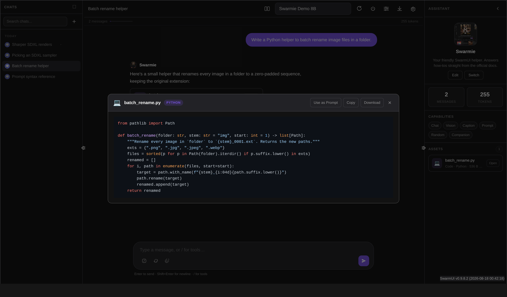

From there: **Copy**, **Download**, **Use as Prompt** (text → the Generate tab's prompt box) or **Use as Init** (image → the Generate tab's init image).

Files written by `file_write` land in `Output/<user>/llm_assistant/<path>`, appear in chat as a clickable link, and load their contents lazily in the viewer. An orphan GC sweeps unreferenced uploads and avatars daily with a 24-hour grace period.

---

## Companion overlay

An opt-in floating helper that lives over the whole SwarmUI UI, not just the LLM tab.

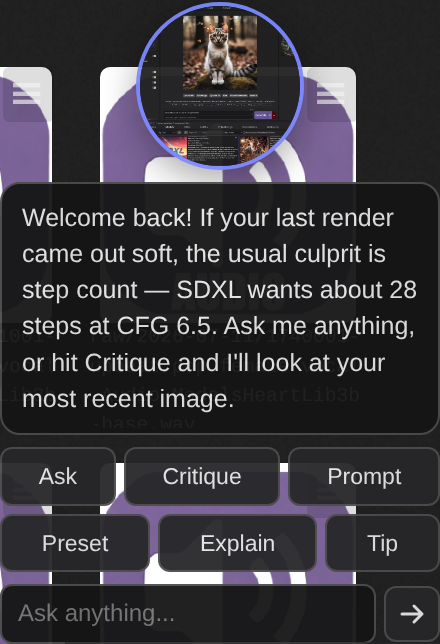

Turn it on in `Settings > Companion`.

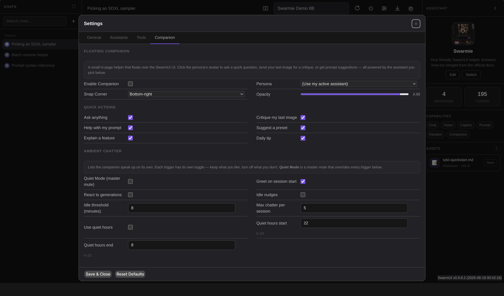

- **Persona** — a specific assistant, or "follow my active assistant".
- **Position** — snaps to a corner; drag for a free offset. Opacity is adjustable.
- **Quick actions** — ask anything, critique my last image, help with my prompt, suggest a preset, explain a feature, daily tip. Each is individually toggleable.
- **Ambient chatter** — optional unsolicited messages on session start, after a generation finishes, or when you've been idle. Every trigger has its own switch, plus **Quiet Mode** as a master mute, quiet hours, and a hard per-session cap.

Replies use the assistant's `companion` instruction, which asks for one short paragraph — the bubble is small on purpose.

---

## Per-user memory

A strictly private profile per user: preferred name, pronouns, bio, current work, preferences, dislikes, and free-form facts. Capped at 50 list entries, 100 facts, and 2000 characters per field.

Swarmie writes to it naturally as a conversation reveals things; nothing is ever asked just to fill a slot. Memory is injected into the system prompt via `{{userProfile}}`.

**Memory is never visible to another user and there is no shared memory layer.** Clear it any time with `LLMAssistantClearUserProfile`.

---

## Generate-tab integration

The extension registers a parameter group called **LLM Prompt Processing** in the Generate sidebar. Toggle the group on to use it.

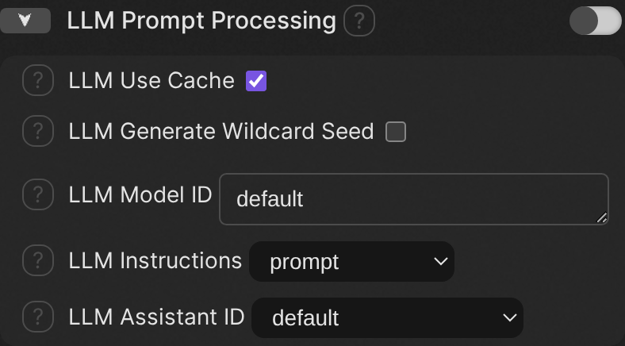

| Parameter | Default | Purpose |
|---|---|---|
| `LLM Use Cache` | `true` | Reuse the response for identical prompts within a batch. |
| `LLM Generate Wildcard Seed` | `false` | Generate one shared wildcard seed per batch so `<wildcard>` picks stay consistent while the LLM is only called once. |
| `LLM Model ID` | `default` | Override which LLM handles prompt processing. |
| `LLM Instructions` | `prompt` | Which instruction set to use — any built-in mode or a custom instruction. |
| `LLM Assistant ID` | `default` | Pin processing to a specific assistant's persona and variants. Default = your active assistant. |

### Prompt tags

| Tag | Meaning |
|---|---|
| `<llmprompt:a rough idea>` | At generation time the inner text goes to the LLM under the chosen instructions; the tag is replaced by the reply. |
| `<llmoriginal>` | Re-inject the original, pre-LLM text into the prompt. |
| `<llmresponse:…>` | Internal marker for a cached response. |

`<mpprompt>`, `<mpresponse>`, and `<mporiginal>` are accepted as aliases — prompts written for Hartsy's MagicPrompt extension work unchanged.

Example:

```
<llmprompt:a cozy cabin in the snow, cinematic>, (highly detailed:1.2)
```

---

## Settings reference

`Settings > General`:

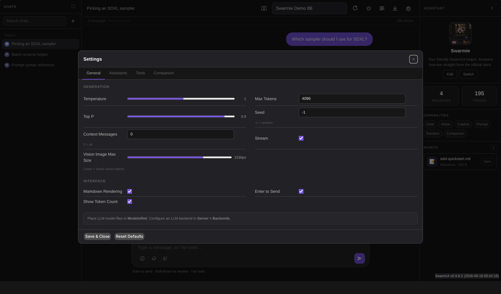

| Setting | Default | Notes |
|---|---|---|
| Temperature | `1.0` | 0–2. |
| Max Tokens | `4096` | Response length cap. |
| Top P | `0.9` | Nucleus sampling cutoff. |
| Seed | `-1` | `-1` = random. Only providers that honor a seed use it. |
| Context Messages | `0` | Prior messages included per request; `0` = all. |
| Stream | `true` | WebSocket streaming. |
| Vision Image Max Size | `1536` | Long-edge cap in px, clamped to 256–2048. |
| Markdown Rendering | `true` | |
| Enter to Send | `true` | Off = `Enter` makes a newline. `Ctrl/Cmd+Enter` always sends either way. |
| Show Token Count | `true` | |

Assistant-level parameter overrides beat these; per-thread overrides (the sliders icon in the top bar) beat both.

---

## Network connections

Per SwarmUI's extension standards, everything this extension can send over the network, and when:

| Connection | When | Off switch |
|---|---|---|
| `html.duckduckgo.com` | Only when the model (or you, via `/`) calls the `web_search` tool | Disable the tool, or deny `llm_tool_web_search` |
| Any public URL | Only when the `http_request` tool is called (SSRF-guarded: loopback/private/link-local/metadata addresses are blocked) | Disable the tool, or deny `llm_tool_http_request` |
| `api.anthropic.com` (or your configured `BaseUrl`) | Only when a chat request routes to an Anthropic backend you added | Don't add the backend |
| Your configured `Address` | Only when a chat request routes to an OpenAI-compatible backend you added | Don't add the backend |

Everything else is local: the HartsyInference engine runs in-process with no network access, and every front-end library (marked, highlight.js, KaTeX, Mermaid, DOMPurify) is bundled — **the UI itself makes zero outbound connections.**

---

## Permissions

Sixteen permissions, all under the **LLMAssistant** group in `Server > Users`. Defaults are deliberately conservative.

| Permission | Default | Covers |
|---|---|---|
| `llm_chat` | POWERUSERS | Send messages, upload chat images, count tokens, run a tool from the picker |
| `llm_settings` | POWERUSERS | Read/write settings, assistants, tools, instructions |
| `llm_models` | POWERUSERS | List models, unload models |
| `llm_threads` | POWERUSERS | Threads, assets, session state |
| `llm_shared_write` | ADMINS | Write the shared/admin baseline; read the audit log |
| `llm_companion` | POWERUSERS | The floating overlay |
| `llm_tool_generate_image` | POWERUSERS *(untested)* | `generate_image` |
| `llm_tool_create_image_preset` | POWERUSERS *(untested)* | `create_image_preset` |
| `llm_tool_vision` | POWERUSERS | `caption_image`, `fuse_image_descriptions`, `batch_caption_folder` |
| `llm_tool_web_search` | POWERUSERS *(untested)* | `web_search` |
| `llm_tool_file_read` | POWERUSERS *(risky)* | `file_read` |
| `llm_tool_file_write` | POWERUSERS *(risky)* | `file_write` |
| `llm_tool_http_request` | POWERUSERS *(risky)* | `http_request` |
| `llm_tool_shell_exec` | **NOBODY** *(powerful)* | `shell_exec` |
| `llm_tool_memory` | POWERUSERS | `memory_read`, `memory_write` |
| `llm_tool_swarm_docs` | USER | `swarm_docs` |

SwarmUI also auto-registers `view_extension_tab_llmassistant` (default USER) for tab visibility.

---

## Multi-user model

Settings live in two layers:

- **Shared** — the admin-curated baseline: shared assistants, shared tools, default instructions and parameters. Writing to it requires `llm_shared_write`.
- **Personal** — each user's own overrides, personal assistants, personal tools, and preferred model.

Reads return the merged view. Assistants and tools are union-merged, personal winning on id collision, and every entry is tagged with a `_scope` badge (`shared` / `personal`) so the UI shows which layer an item lives in and which layer a delete would hit.

Threads, memory, uploads, and session state are always strictly per-user.

---

## API reference

Every endpoint follows [SwarmUI's standard API conventions](https://github.com/mcmonkeyprojects/SwarmUI/blob/master/docs/API.md): `POST /API/<RouteName>` with a JSON body that includes a `session_id` from `GetNewSession`. Routes marked **WS** take a WebSocket connection instead.

```bash
# Get a session
SID=$(curl -s -H "Content-Type: application/json" -d '{}' \
  -X POST http://localhost:7801/API/GetNewSession | jq -r .session_id)

# What models are available?
curl -s -H "Content-Type: application/json" -d "{\"session_id\":\"$SID\"}" \
  -X POST http://localhost:7801/API/LLMAssistantGetModels
```

### Chat

| Route | Method | Request | Returns |
|---|---|---|---|
| `LLMAssistantCreateThread` | POST | `assistantId?`, `title?` | `{success, thread}` |
| `LLMAssistantSendMessage` | POST | `message`, `instructionId?`, `model?`, `temperature?`, `maxTokens?`, `noCache?`, `assistantId?` | `{success, response}` — one-shot, does **not** touch threads |
| `LLMAssistantSendMessageWS` | **WS** | `threadId`, `message`, `userMessageId?`, `assistantMessageId?`, `model?`, `models?`, `media?`, `instructionId?`, `forceToolId?`, `temperature?`, `maxTokens?`, `seed?` | streaming frames (below) |
| `LLMAssistantEditMessageWS` | **WS** | `threadId`, `messageId`, `content`, `userMessageId?`, `assistantMessageId?`, … | streaming frames; forks a new branch |
| `LLMAssistantRegenerateWS` | **WS** | `threadId`, `messageId`, `assistantMessageId?`, … | streaming frames; new sibling reply |
| `LLMAssistantUploadChatImage` | POST | `threadId`, `messageId`, `imageData` (data URI) | `{success, url, mediaType, width, height, bytesWritten}` |
| `LLMAssistantTestInstruction` | POST | `instructionText`, `sampleInput`, `model?`, `assistantName?` | `{success, response}` — persists nothing |
| `LLMAssistantCountTokens` | POST | `text` **or** `messages[]` | `{success, count, exact, source}` |

Pass a `models` array of `{model, device?, backendId?, assistantMessageId?}` with **two or more** entries to `LLMAssistantSendMessageWS` and it runs compare mode instead of a single reply.

#### Streaming frames

Each WebSocket frame is one JSON object. In compare mode every frame also carries a `lane` index.

| Frame | Meaning |
|---|---|
| `{"chunk": "…"}` | A piece of the reply text. |
| `{"status": …}` | Backend progress (e.g. model loading). Forwarded verbatim. |
| `{"iteration": n}` | The agentic loop started round *n*. |
| `{"tool_call": {id, name, arguments}}` | A tool call was resolved and is about to run. |
| `{"tool_result": {id, name, result}}` | That tool finished. |
| `{"done": true, "full_text": "…", "stopReason": …}` | Generation finished. `stopReason: "length"` means the token cap cut it off. |
| `{"done": true, "truncated": true, "reason": "max_iterations"}` | The 8-round agentic cap was hit. |
| `{"titleUpdated": "…", "threadId": "…"}` | The chat was auto-titled from its first exchange. |
| `{"error": "…"}` | A failure after streaming began. |
| `{"lane": n, …}` | Compare mode — routes the frame to a column. |

### Threads

| Route | Request | Returns |
|---|---|---|
| `LLMAssistantGetThreads` | — | `{success, threads[]}` (index only) |
| `LLMAssistantGetThread` | `threadId` | `{success, thread}` |
| `LLMAssistantDeleteThread` | `threadId` | `{success}` |
| `LLMAssistantRenameThread` | `threadId`, `title` | `{success, thread}` — also settable with `F2` in the sidebar |
| `LLMAssistantEditMessage` | `threadId`, `messageId`, `content` | `{success, thread}` |
| `LLMAssistantDeleteMessage` | `threadId`, `messageId` | `{success, thread}` |
| `LLMAssistantSetActiveLeaf` | `threadId`, `messageId` | `{success, thread}` — switch branch |
| `LLMAssistantSetThreadToolsEnabled` | `threadId`, `enabled?` | `{success, thread}` — omit `enabled` to clear the override |
| `LLMAssistantExportThread` | `threadId`, `format` (`json` \| `markdown`) | `{success, filename, content}` |

### Assistants

| Route | Request | Returns |
|---|---|---|
| `LLMAssistantGetAssistants` | — | `{success, assistants[], activeAssistantId}` |
| `LLMAssistantGetAssistant` | `assistantId` | `{success, assistant}` |
| `LLMAssistantGetActiveAssistant` | — | `{success, assistant}` |
| `LLMAssistantSaveAssistant` | `assistant` (object), `scope?` | `{success, id, scope}` |
| `LLMAssistantDeleteAssistant` | `assistantId`, `scope?` | `{success}` |
| `LLMAssistantSetActiveAssistant` | `assistantId` | `{success}` |
| `LLMAssistantUploadAssistantAvatar` | `assistantId`, `imageData` (data URI, ≤2 MB) | `{success, url, bytesWritten}` |
| `LLMAssistantGetStarterTemplates` | — | `{success, templates[]}` |

### Tools

| Route | Request | Returns |
|---|---|---|
| `LLMAssistantGetTools` | — | `{success, tools[], canWriteShared}` |
| `LLMAssistantGetTool` | `toolId` | `{success, tool}` |
| `LLMAssistantSaveTool` | `tool` (object or JSON string), `scope?` | `{success, id, scope}` |
| `LLMAssistantDeleteTool` | `toolId`, `scope?` | `{success}` |
| `LLMAssistantExecuteTool` | `toolId`, `arguments` (object or JSON string), `assistantId?`, `threadId?`, `callId?` | `{success, result, callId}` |
| `LLMAssistantGetToolConfig` | `toolId` | `{success, config}` |
| `LLMAssistantSetToolConfig` | `toolId`, `config` (object or JSON string) | `{success, config}` |
| `LLMAssistantGetImagePresets` | — | `{success, presets[]}` with a one-line `summary` per preset |

`LLMAssistantExecuteTool` still enforces the per-handler `llm_tool_*` permission, so exposing it at the chat permission level is not an escalation.

### Settings, models, and the rest

| Route | Request | Returns |
|---|---|---|
| `LLMAssistantGetSettings` | — | `{success, settings, canWriteShared}` |
| `LLMAssistantSaveSettings` | `settings` (object or JSON string), `scope?` | `{success, settings, scope}` |
| `LLMAssistantResetSettings` | `scope?` | `{success, settings, scope}` |
| `LLMAssistantGetAuditLog` | `max?` (default 200, cap 5000) | `{success, enabled, entries[]}` — admin only |
| `LLMAssistantSetAuditLogEnabled` | `enabled` | `{success, enabled}` — admin only |
| `LLMAssistantGetModels` | — | `{success, models[], warnings[]}` — providers are queried in parallel under a timeout; a slow backend degrades into a warning instead of hanging the call |
| `LLMAssistantUnloadModels` | — | `{success, freed, providers}` — `freed` counts providers that actually released something |
| `LLMAssistantGetSessionState` | — | `{success, state}` |
| `LLMAssistantSetSessionState` | `state` (patch object; `null` clears a key) | `{success, state}` |
| `LLMAssistantGetAssets` | `threadId` | `{success, threadId, assets[]}` |
| `LLMAssistantGetAsset` | `threadId`, `assetId` | `{success, asset}` |
| `LLMAssistantDeleteAsset` | `threadId`, `assetId` | `{success}` |
| `LLMAssistantGetUserProfile` | — | `{success, profile}` |
| `LLMAssistantClearUserProfile` | — | `{success}` |
| `LLMAssistantGetCompanionContext` | — | `{success, lastImage}` (`null` when you have no generations yet) |
| `LLMAssistantGetInstructions` | — | `{success, instructions[]}` — legacy, kept for the T2I prompt tags |
| `LLMAssistantSaveInstruction` | `id`, `title`, `content`, `categories?`, `tooltip?`, `scope?` | `{success, instruction}` |
| `LLMAssistantDeleteInstruction` | `id`, `scope?` | `{success}` |

### Worked example: a full chat turn

```python
import asyncio, json, urllib.request
import websockets  # pip install websockets

BASE = "http://localhost:7801/API"

def call(route, payload):
    req = urllib.request.Request(f"{BASE}/{route}", data=json.dumps(payload).encode(),
                                 headers={"Content-Type": "application/json"})
    return json.loads(urllib.request.urlopen(req).read())

sid = call("GetNewSession", {})["session_id"]
thread_id = call("LLMAssistantCreateThread", {"session_id": sid, "assistantId": "default"})["thread"]["id"]

async def chat(text):
    async with websockets.connect("ws://localhost:7801/API/LLMAssistantSendMessageWS") as ws:
        await ws.send(json.dumps({
            "session_id": sid,
            "threadId": thread_id,
            "message": text,
            "model": "claude-sonnet-5",
        }))
        async for raw in ws:
            frame = json.loads(raw)
            if "chunk" in frame:
                print(frame["chunk"], end="", flush=True)
            elif "tool_call" in frame:
                print(f"\n[calling {frame['tool_call']['name']}]")
            elif frame.get("done"):
                break

asyncio.run(chat("How do I use wildcards in a prompt?"))
```

---

## Architecture

```
SwarmUI-LLMAssistant/
├── LLMAssistantExtension.cs   Entry point: assets, model type, tools, API, migrations, GC
├── Constants.cs               Instruction ids, feature keys, tool ids, roles
├── LLMs/                      The stable seam — no concrete backend referenced here
│   ├── ILLMProvider.cs        The interface + LLMProviderRegistry
│   ├── LLMTypes.cs            Extension-owned DTOs
│   ├── LLMDispatcher.cs       Routes to the provider serving a model; token counting
│   ├── LLMModelLookup.cs      Cached ListModels() with a 5-minute TTL
│   ├── LLMModelMatcher.cs     Exact / Family / Provider / Tag / Glob / Default matching
│   ├── ExtendedLLMInput.cs    Request shape (messages, params, media, tools)
│   ├── LLMStreamHelper.cs     Agentic loop, WS framing, server-side persistence
│   └── SwarmNativeLLMProvider.cs   Optional bridge to native Swarm backends (off)
├── Backends/                  REMOVABLE runtime pack
│   ├── LLMProviderBackend.cs  AbstractLLMBackend + ILLMProvider base; self-registers
│   ├── HartsyLocalLLMProvider.cs   Pure-C# GGUF via HartsyInference.Engine
│   ├── AnthropicLLMProvider.cs     Anthropic Messages API
│   ├── RemoteOpenAILLMProvider.cs  Any OpenAI-compatible endpoint
│   └── LLMBackendPack.cs      One Register() call
├── Services/                  Assistants, instructions, threads, tools, media, memory,
│                              settings layers, rate limits, audit log, JSON repair, GC
├── Tools/BuiltIn/             The 13 built-in tool handlers
├── T2I/                       Generate-tab parameters and <llmprompt> processing
├── WebAPI/                    51 endpoints across 11 files + permission definitions
├── Tabs/Text2Image/           Tab markup (`LLM Assistant.html` — the filename is the tab label)
└── Assets/                    Front-end JS/CSS, starter templates, vendored libraries
```

### Design notes

**One seam.** The whole feature surface — chat, threads, tools, companion, T2I — talks only to `ILLMProvider` through `LLMProviderRegistry`. It never names a concrete backend and never references SwarmUI's `AbstractLLMBackend`. The runtimes live in `Backends/`, which is deliberately disposable.

**Server-authoritative history.** The client can't inject fake history. Your message is appended to the stored thread before the model is called; the reply is appended after the agentic loop finishes. Message edits and deletes go through their own endpoints rather than the client re-uploading the thread.

**In-tab modal.** The settings dialog is `position: absolute; inset: 0` inside the tab pane, not fixed to the viewport — a Bootstrap modal would float over the whole SwarmUI UI and break the tab metaphor.

**Zero external dependencies at runtime.** marked, highlight.js, KaTeX (with fonts), Mermaid, and DOMPurify are vendored under `Assets/vendor/` and registered by directory walk, then lazy-loaded on first use. Nothing is fetched from a CDN.

**Reused SwarmUI styling.** `.basic-button`, `.splitter-bar`, and the theme CSS variables (`--text`, `--emphasis`, `--light-border`, …). The tab inherits SwarmUI's theme, including custom ones.

### Swapping or removing the runtime pack

To drop the bundled backends — say, once SwarmUI ships a first-class native LLM API you'd rather use:

1. Delete the `Backends/` folder.
2. Remove the `Backends.LLMBackendPack.Register();` line from `LLMAssistantExtension.OnInit`.
3. Delete the `HartsyInference` `PackageReference` and the `ExcludeAssets` block from the csproj, and put `CopyLocalLockFileAssemblies` back to its default.
4. Register a replacement `ILLMProvider`. A ready-made bridge to native Swarm backends ships as `LLMs/SwarmNativeLLMProvider.cs` (disabled by default) — call `SwarmNativeLLMProvider.Register()` from `OnInit` instead of the pack.

Nothing in chat, threads, tools, companion, or the T2I integration changes.

### Building against a local engine checkout

The csproj resolves `HartsyInference` from NuGet by default. To build against a local engine clone instead:

```bash
dotnet build src/Extensions/SwarmUI-LLMAssistant/SwarmUI-LLMAssistant.csproj -p:UseLocalHartsy=true
```

Build the engine first (`HartsyInference.{LLM,Cpu,Cuda}` at `net8.0`), and override `HartsyRepo` if your checkout isn't a sibling of the SwarmUI folder. **Never commit a `-local` version pin** — end users only have nuget.org.

---

## Troubleshooting

**"No LLM backend is running."**
Add one under `Server > Backends`. The quickest path is *LLM: Remote (OpenAI-Compatible)* pointed at a local Ollama (`http://localhost:11434`).

**The model list is empty, or shows a warning.**
Each provider is queried in parallel under a bounded timeout, and anything that times out is reported in `warnings` rather than hanging the request. Check the backend's status in `Server > Backends` and its logs.

**"No Anthropic API key set" / OpenAI 401.**
Keys are per-user. Set yours in the `User` tab — the backend config does not carry one.

**Tool calls never fire.**
Check, in order: the tool is enabled globally (`Settings > Tools`); it's checked on the current assistant; the assistant's tool master switch is on; the composer's wrench toggle is on for this chat; and you hold the matching `llm_tool_*` permission. Small local models also follow the `<tool_call>` convention unreliably — try a larger instruct-tuned model, or a provider with native tool calling.

**`<llmprompt>` tags aren't processed.**
Toggle the **LLM Prompt Processing** group on in the Generate sidebar, make sure an LLM model resolves, and check the server log for the `[LLMAssistant]` prefix.

**The chat list is empty after sending.**
Threads persist on the first message. If nothing appears, the send failed — check the log for `ThreadStorageService` errors.

**The settings modal renders outside the tab.**
The modal is scoped to the tab pane. If it escapes, `.llma-container` has lost `position: relative` or the tab pane has lost `position: relative; height: 100%`.

**The companion never appears.**
It's opt-in — enable it in `Settings > Companion`, and make sure you have `llm_companion`.

**"I can't see images."**
Either the selected model isn't vision-capable or the assistant has no `vision` instruction. Switch to a vision model (a Claude model, a vision-tagged Ollama model, or a multimodal GGUF with its mmproj alongside).

---

## Known limitations

- **Compare mode doesn't auto-title** the chat — single-model turns do.
- **The companion bubble renders plain text**, not Markdown, by design; its instruction asks the model for one short prose paragraph.
- **Shared assistant avatars** are served from the uploading user's output folder, so another user needs SwarmUI's `View Others Outputs` permission to see them. Personal avatars are unaffected.
- **`GraphDecode` and `SpeculativeDecode`** only engage on greedy (temperature 0) requests, so the default chat temperature does not use them yet.
- **`StructuredToolCalling`** is off by default — it's new and not yet verified against a broad set of local models.
- **MCP tools** (`mcp_stdio` / `mcp_http`) are reserved handler types, not yet implemented.

---

## License & credits

MIT — see [LICENSE](LICENSE).

- [SwarmUI](https://github.com/mcmonkeyprojects/SwarmUI) and [mcmonkey](https://github.com/mcmonkey4eva) — the platform this builds on.
- [HartsyInference](https://www.nuget.org/packages/HartsyInference) — the pure-C# local inference engine.
- [marked](https://marked.js.org/), [highlight.js](https://highlightjs.org/), [KaTeX](https://katex.org/), [Mermaid](https://mermaid.js.org/), [DOMPurify](https://github.com/cure53/DOMPurify) — markdown, code, math, diagrams, sanitization. All vendored locally; see [`Assets/vendor/FETCH.md`](Assets/vendor/FETCH.md).
